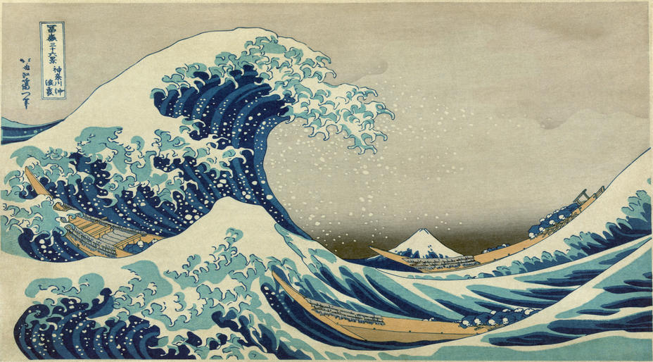

# Neural Style Transfer

The repository contains PyTorch implementation of the [Gatys *et al.*](https://www.cv-foundation.org/openaccess/content_cvpr_2016/papers/Gatys_Image_Style_Transfer_CVPR_2016_paper.pdf) paper with some modifications. The authors propose algorithm that transfers style from one input image (the *style* image) into second image (the *content* image).

## Examples

Some of the hand picked results:

## Setup

1. Clone the repository `git clone https://github.com/gcerar/pytorch-neural-style-transfer`
2. Enter directory `cd pytorch-neural-style-transfer`
3. Run `conda env create -f ./environment.yml`
4. Run `conda activate style-transfer`

It is recommended to use GPU to accelerate the style transfer process.

## Usage

`python style_transfer.py --input <TargetImgPath> --style <StyleImgPath>`

Optional parameters:

- `--help` or `-h` print help with all available parameters
- `--epochs <number>` (default: 7000)
- `--seed <number>` (default: 1)
- `--no-cuda` disables CUDA acceleration and use CPU instead
- `--optimizer <adam|adamw|lbfgs|sgd>` (default: adam)
- `--init <input|noise>` decide on what is init of output image (default: input)

## Acknowledgment

Useful articles with code and code repositories:

- Gregor Koehler *et al.* [gkoehler/pytorch-neural-style-transfer](https://nextjournal.com/gkoehler/pytorch-neural-style-transfer) (best resource in my opinion)
- Ritul's [Medium article](https://medium.com/udacity-pytorch-challengers/style-transfer-using-deep-nural-network-and-pytorch-3fae1c2dd73e) (good resource)
- Pragati Baheti [blog](https://www.v7labs.com/blog/neural-style-transfer) visually present style extraction
- Aleksa Gordić ([gordicaleksa/pytorch-neural-style-transfer](https://github.com/gordicaleksa/pytorch-neural-style-transfer))
- [ProGamerGov/neural-style-pt](https://github.com/ProGamerGov/neural-style-pt/blob/master/neural_style.py)
- Katherine Crowson ([rowsonkb/style-transfer-pytorch](https://github.com/crowsonkb/style-transfer-pytorch/blob/master/style_transfer/style_transfer.py))
- Derrick Mwiti's [Medium article](https://heartbeat.comet.ml/neural-style-transfer-with-pytorch-49e7c1fe3bea)
- Aman Kumar Mallik's [Medium article](https://towardsdatascience.com/implementing-neural-style-transfer-using-pytorch-fd8d43fb7bfa)

Sample *content* images:

<figure>
    
    <figcaption>"Gray Bridge and Trees", Martin Damboldt</figcaption>
</figure>

Style images:

<figure>
    
    <figcaption>Bamboo forest, ???</figcaption>
</figure>

<figure>
    
    <figcaption>"June tree", Natasha (Wescoat) Bouchillion</figcaption>
</figure>

<figure>
    
    <figcaption>Colorful whirlpool, ???</figcaption>
</figure>

<figure>
    
    <figcaption>"Composition VII", Wassily Kandinsky</figcaption>
</figure>

<figure>
    
    <figcaption>"Doomguy", ID Software</figcaption>
</figure>

<figure>
    
    <figcaption>"Edtaonisl", Francis Picabia</figcaption>
</figure>

<figure>
    
    <figcaption>"Hand with Reflecting Sphere", M. C. Escher</figcaption>
</figure>

<figure>
    
    <figcaption>Feather leaves and petals, Kathryn Corlett</figcaption>
</figure>

<figure>
    
    <figcaption>Flowers, ???</figcaption>
</figure>

<figure>
    
    <figcaption>Fractal Patterns, ???</figcaption>
</figure>

<figure>
    
    <figcaption>"La Muse", Pablo Picasso</figcaption>
</figure>

<figure>
    
    <figcaption>"Lady", ???</figcaption>
</figure>

<figure>
    
    <figcaption>"Mondrian World Map", Michael Tompsett</figcaption>
</figure>

<figure>
    
    <figcaption>"The Night Café", Vincent van Gogh</figcaption>
</figure>

<figure>
    
    <figcaption>"Saul of Tarsus", Marko Ivan Rupnik</figcaption>
</figure>

<figure>
    
    <figcaption>"The Persistence of Memory", Salvador Dali</figcaption>
</figure>

<figure>
    
    <figcaption>"Mysterious Rain Princess", Leonid Afremov</figcaption>
</figure>

<figure>
    
    <figcaption>"Seated Nude", Pablo Picasso</figcaption>
</figure>

<figure>
    
    <figcaption>"The Starry Night", Vincent van Gogh</figcaption>
</figure>

<figure>
    
    <figcaption>"The Scream", Edvard Munch</figcaption>
</figure>

<figure>
    
    <figcaption>"Udnie", Francis Picabia</figcaption>
</figure>

<figure>
    
    <figcaption>"Walking in the Rain", Leonid Afremov</figcaption>
</figure>

<figure>
    
    <figcaption>"Under the Wave off Kanagawa", Katsushika Hokusai</figcaption>
</figure>

